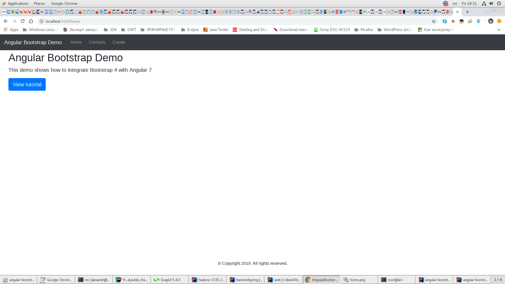
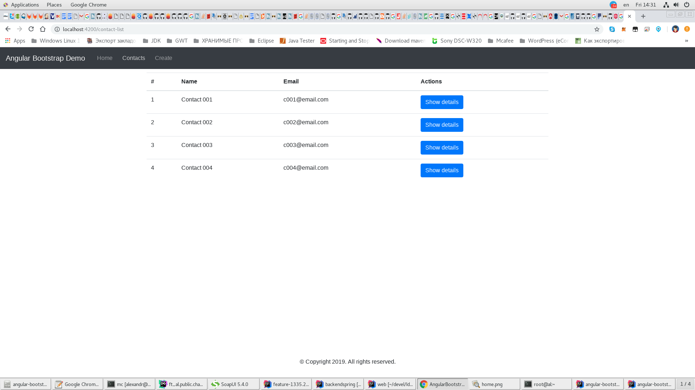
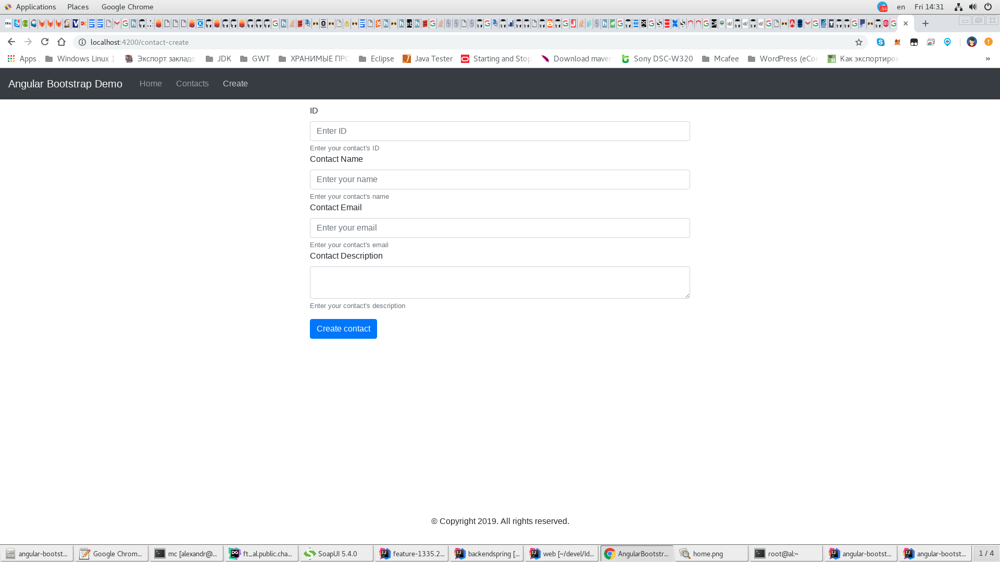
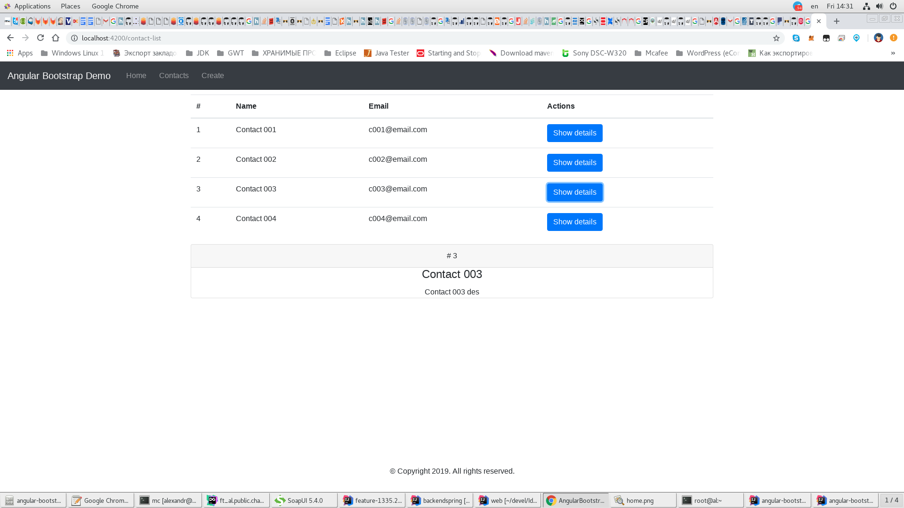

# Angular 7 & Bootstrap 4 Demo

* https://github.com/techiediaries/angular-bootstrap-demo

## Development server

Run `ng serve` for a dev server. Navigate to `http://localhost:4200/`. The app will automatically reload if you change any of the source files.

## Build

Run `ng build` to build the project. The build artifacts will be stored in the `dist/` directory. Use the `--prod` flag for a production build.

